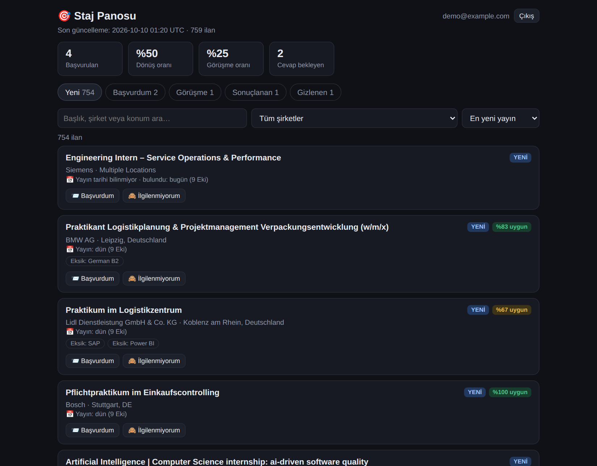
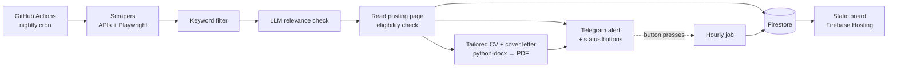

# Internship Tracker

An automated pipeline that finds engineering internships across Europe every night, filters them for
relevance and eligibility, and for each new posting delivers a Telegram alert plus a tailored CV and cover letter.
A private web board tracks every application.

Built for my own internship search (industrial engineering, Erasmus+), and now used by two people.



## What it does

- **Collects ~30,000 postings a night** from public job boards (Bundesagentur für Arbeit, Arbeitnow, Stageplaza)
  and 40+ company career sites (Workday, SAP SuccessFactors, SmartRecruiters, Greenhouse, Amazon, Continental, …).
- **Filters in three stages**:
  1. Keyword rules: field, internship type, European location, excluded roles such as Werkstudent or thesis.
  2. An LLM check of each title. The model must echo the title back, so a misaligned answer is caught.
  3. An eligibility check that reads the full posting page. It drops postings that require final-year or
     Master's students, but only when the model quotes the exact sentence from the posting that says so.
     A quote that is not in the page is rejected.
- **Writes a tailored CV and cover letter** (PDF) for each new posting:
  - Only the summary, at most four bullets and the order of skills may change.
  - Any edit that introduces a name, number or acronym not already in the master CV is discarded.
  - Cliché phrases are stripped from the letter.
  - A fit score (`met / total` key requirements) is attached.
- **Tracks applications** from Telegram buttons or the web board: Applied, Interview, Rejected, Offer, Skip.
  - Each person's statuses are private.
  - Weekly summaries report response and interview rates.
- **Web board**: posting dates, "new since last visit" badges, sorting by date or by fit, and Google sign-in.
  Firestore security rules allow each account to read only its own data.

## Architecture



## Tech stack

| Area | Tools |
|---|---|
| Language | Python 3.12 |
| Scraping | requests, BeautifulSoup, Playwright (headless Chromium) |
| AI | NVIDIA NIM (Nemotron) through an OpenAI-compatible API |
| Data | Google Cloud Firestore, Firebase Hosting, Firebase Auth (Google sign-in) |
| Documents | python-docx, LibreOffice (headless PDF export) |
| Notifications | python-telegram-bot (inline keyboards) |
| Automation | GitHub Actions: nightly scrape, hourly Telegram sync |

## Engineering notes

- **Privacy in a public repo.**
  - Master CVs are stored AES-256 encrypted and decrypted only inside the workflow.
  - Logs never print CV or letter text.
  - Application statuses live only in Firestore and Telegram, never in the public page.
- **Hallucination guards.**
  - LLM output is checked against the source text: echoed titles for the relevance batch, verbatim quotes for
    eligibility decisions, and a token check against the master CV for CV edits.
  - When the model fails or is unsure, the posting is kept and the CV stays unchanged.
- **Robust scheduling.**
  - GitHub's cron runs hours late on this repo, so the job is scheduled for the evening and its results are
    ready by morning.
  - A concurrency group stops two runs from notifying the same posting twice.
  - Telegram button presses are polled hourly, because the project has no server.
- **Data quality.**
  - Mojibake repair.
  - Duplicate postings for the same company and title are suppressed.
  - Posting dates are parsed from several formats, including Workday's "Posted 30+ Days Ago".
  - 2- and 3-letter country codes are mapped to drop non-European locations.

## Repository layout

```
run.py              nightly pipeline
track.py            hourly Telegram button/command sync
scrapers/           one module per source, each exposing scrape() -> list[dict]
lib/
  filters.py        keyword / location / role filters
  ai_filter.py      LLM relevance check
  eligibility.py    year-of-study check with verbatim evidence
  application.py    CV + cover letter tailoring and fit score
  tracking.py       application statuses, Telegram commands, weekly stats
  export_html.py    static web board
  store.py          Firestore access
firestore.rules     per-user access rules for the board
```

Setup steps (secrets, Firebase, Telegram) are in [SETUP.md](SETUP.md) (Turkish).

## Author

Muhammet Kaan Doğru, Industrial Engineering student.
